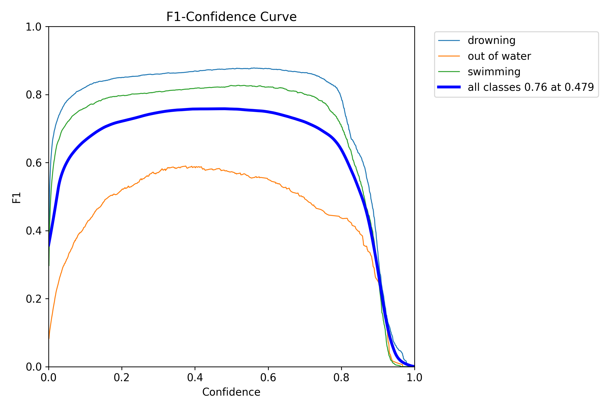
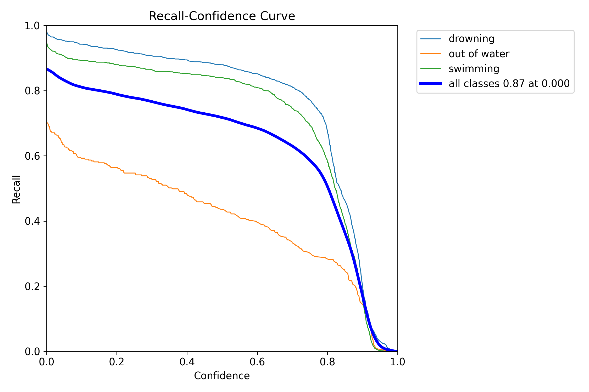
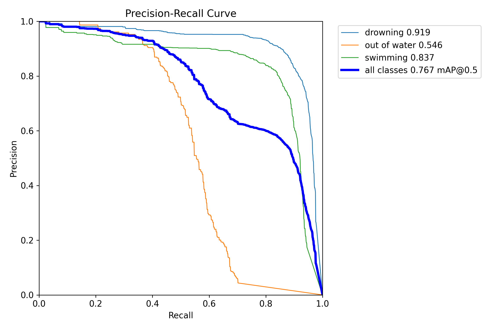
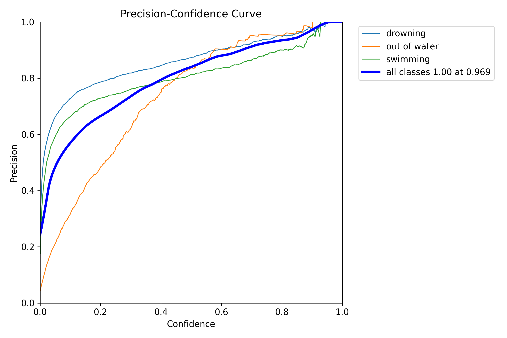

# H20Saver

## 项目简介

本项目旨在实现一个高效的溺水目标检测系统，基于 YOLO11x 模型进行微调。项目包含数据集分析、模型训练、评估和部署的完整流程，适用于溺水检测相关的研究和实际应用。

## 文件结构

```
H20Saver/
├── LICENSE
├── requirements.txt
├── results
│   ├── data_analysis.out
│   │   ├── bbox_analysis.png
│   │   ├── bbox_boxplot.png
│   │   ├── bbox_heatmap.png
│   │   ├── class_distribution.png
│   │   ├── class_distribution_pie.png
│   │   ├── class_imbalance.png
│   │   └── data_quality_report.txt
│   └── training
│       ├── F1_curve.png
│       ├── PR_curve.png
│       ├── P_curve.png
│       ├── R_curve.png
│       ├── args.yaml
│       ├── confusion_matrix.png
│       ├── confusion_matrix_normalized.png
│       ├── evaluation_values.txt
│       ├── labels.jpg
│       ├── labels_correlogram.jpg
│       ├── results.png
│       ├── train_batch0.jpg
│       ├── train_batch1.jpg
│       ├── train_batch2.jpg
│       ├── train_batch46260.jpg
│       ├── train_batch46261.jpg
│       ├── train_batch46262.jpg
│       ├── training_logs.csv
│       ├── val_batch0_labels.jpg
│       ├── val_batch0_pred.jpg
│       ├── val_batch1_labels.jpg
│       ├── val_batch1_pred.jpg
│       ├── val_batch2_labels.jpg
│       └── val_batch2_pred.jpg
├── setup.py
└── src
    ├── data_analysis.py
    ├── model_evaluation.py
    └── train.py
```

## 数据集概述

### 数据集统计

- 总图像数量：14111
- 有效标注图像：14111
- 缺失标注文件：0 (0.0%)
- 损坏/不可读图像：0 (0.0%)
- 无效标注行数：0

数据集整体质量较高，所有图像均有效且标注完整，无缺失或损坏情况。

### 类别分布

- **Drowning**：41.4%
- **Swimming**：38.1%
- **Out of Water**：20.5%

类别分布存在一定的不均衡，可能需要在模型训练时进行数据增强或采样策略调整。

### 样本数量

- **Drowning**：约 12000 样本
- **Swimming**：约 10000 样本
- **Out of Water**：约 5500 样本

"Out of Water" 类别的样本数量较少，可能影响模型对该类别的识别性能。

### 标注框尺寸分析

- 宽度和高度主要集中在 0.2 到 0.6 的归一化范围内。
- 标注框中心点分布较为均匀，无明显偏移。
- 宽度和高度的中位数均接近 0.4，分布较为集中。
- 存在少量异常值，可能为标注误差或特殊场景。

## 模型训练

### 训练配置

- **数据参数**：
  - 数据集路径：`dataset/data.yaml`
  - 图像尺寸：640
  - 批量大小：23
  - 训练轮数：100
- **数据增强**：
  - HSV 调整、平移、缩放、翻转、Mosaic 和 Mixup 等。
- **优化参数**：
  - 初始学习率：0.001
  - 最终学习率：0.01
  - 动量：0.937
  - 权重衰减：0.0005
- **类别平衡**：
  - 自动计算类别权重
  - 启用焦点损失
- **模型参数**：
  - 预训练模型：`yolo11x.pt`
  - 冻结层：`backbone` 和 `head`
  - 多尺度训练

### 训练过程

训练过程中，模型的损失函数和评估指标如下：

- **训练损失**：
  - `train/box_loss`：边界框回归损失
  - `train/cls_loss`：分类损失
  - `train/dfl_loss`：分布式焦点损失

- **验证损失**：
  - `val/box_loss`：边界框回归损失
  - `val/cls_loss`：分类损失
  - `val/dfl_loss`：分布式焦点损失

- **评估指标**：
  - `metrics/precision(B)`：精确率
  - `metrics/recall(B)`：召回率
  - `metrics/mAP50(B)`：平均精度（IoU=0.5）
  - `metrics/mAP50-95(B)`：平均精度（IoU=0.5:0.95）

### 训练结果

- **最终模型**：
  - `best.pt`：最佳模型权重
  - `last.pt`：最新模型权重

- **评估结果**：
  - `evaluation_values.txt`：包含 mAP、精确率、召回率等指标

## 模型评估

### F1-Confidence 曲线



F1-Confidence 曲线展示了不同置信度阈值下的 F1 分数变化。`drowning` 类别的 F1 分数在高置信度下表现最佳。

### Recall-Confidence 曲线



Recall-Confidence 曲线展示了不同置信度阈值下的召回率变化。`drowning` 类别的召回率在低置信度下表现较高。

### Precision-Recall 曲线



Precision-Recall 曲线展示了不同召回率下的精确率变化。`drowning` 类别的精确率在高召回率下表现最佳。

### Precision-Confidence 曲线



Precision-Confidence 曲线展示了不同置信度阈值下的精确率变化。`drowning` 类别的精确率在高置信度下表现最佳。

## 训练日志

`training_logs.csv` 文件记录了每个训练轮次的详细信息，包括时间、损失值、学习率等。

## 模型部署

### 导出模型

训练完成后，模型可以导出为 ONNX 格式，便于在不同平台上部署：

```python
model.export(format='onnx', imgsz=config.img_size)
```

### 验证结果

```python
metrics = model.val()
print(f"验证结果: mAP@0.5={metrics.box.map:.2f}, mAP@0.5:0.95={metrics.box.map50:.2f}")
```

## 改进建议

- **数据增强**：针对 "Out of Water" 类别样本较少的问题，可以采用数据增强技术（如旋转、缩放、镜像等）或过采样方法来平衡类别分布。
- **标注框尺寸优化**：对于标注框尺寸异常值，建议检查标注质量，修正可能的标注误差。
- **模型训练策略**：在模型训练时，建议采用加权损失函数或焦点损失来缓解类别不均衡问题。针对标注框尺寸分布，可设计多尺度检测模型，提升对小目标和大目标的检测性能。

## 依赖安装

安装项目所需的依赖库：

```bash
pip install -r requirements.txt
```

## 模型权重文件

模型权重文件下载:

```bash
git clone https://huggingface.co/EsonH/best.pt
```

## 联系方式

如有任何问题或建议，请联系作者：Eason Huang (easonhuangjz@outlook.com)
