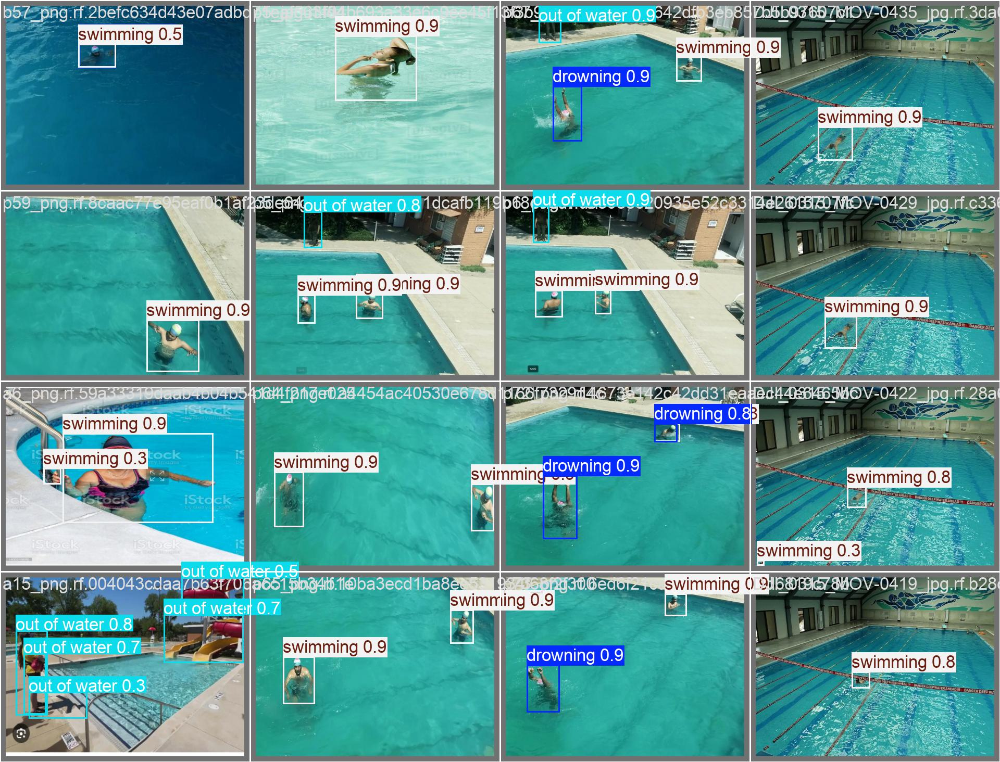

# H20Saver

[中文](README_zh.md) | [English](README.md)

## Project Introduction

This project aims to implement an efficient drowning target detection system, fine-tuned based on the YOLO11x model. The project includes a complete pipeline of dataset analysis, model training, evaluation, and deployment, suitable for research and practical applications related to drowning detection.

## Model Detection Results

The following image demonstrates the detection performance of the model on the validation set:



The image shows the model's predictions on validation set images, including detection of "drowning," "swimming," and "out of water" categories. The model accurately identifies and localizes targets, demonstrating good detection performance.

## File Structure

```
H20Saver/
├── LICENSE
├── requirements.txt
├── results
│   ├── data_analysis.out
│   │   ├── bbox_analysis.png
│   │   ├── bbox_boxplot.png
│   │   ├── bbox_heatmap.png
│   │   ├── class_distribution.png
│   │   ├── class_distribution_pie.png
│   │   ├── class_imbalance.png
│   │   └── data_quality_report.txt
│   └── training
│       ├── F1_curve.png
│       ├── PR_curve.png
│       ├── P_curve.png
│       ├── R_curve.png
│       ├── args.yaml
│       ├── confusion_matrix.png
│       ├── confusion_matrix_normalized.png
│       ├── evaluation_values.txt
│       ├── labels.jpg
│       ├── labels_correlogram.jpg
│       ├── results.png
│       ├── train_batch0.jpg
│       ├── train_batch1.jpg
│       ├── train_batch2.jpg
│       ├── train_batch46260.jpg
│       ├── train_batch46261.jpg
│       ├── train_batch46262.jpg
│       ├── training_logs.csv
│       ├── val_batch0_labels.jpg
│       ├── val_batch0_pred.jpg
│       ├── val_batch1_labels.jpg
│       ├── val_batch1_pred.jpg
│       ├── val_batch2_labels.jpg
│       └── val_batch2_pred.jpg
├── setup.py
└── src
    ├── data_analysis.py
    ├── model_evaluation.py
    └── train.py
```

## Dataset Overview

### Dataset Statistics

- Total Images: 14,111
- Valid Annotated Images: 14,111
- Missing Annotation Files: 0 (0.0%)
- Corrupted/Unreadable Images: 0 (0.0%)
- Invalid Annotation Lines: 0

The dataset is of high quality, with all images valid and annotations complete, with no missing or corrupted data.

### Class Distribution

- **Drowning**: 41.4%
- **Swimming**: 38.1%
- **Out of Water**: 20.5%

There is some class imbalance, which may require data augmentation or sampling strategy adjustments during model training.

### Sample Counts

- **Drowning**: Approximately 12,000 samples
- **Swimming**: Approximately 10,000 samples
- **Out of Water**: Approximately 5,500 samples

The "Out of Water" class has fewer samples, which may affect model performance for this category.

### Bounding Box Size Analysis

- Width and height are mainly concentrated in the normalized range of 0.2 to 0.6.
- Bounding box center points are distributed relatively evenly, with no significant bias.
- The median width and height are both around 0.4, with a concentrated distribution.
- There are a few outliers, which may be due to annotation errors or special scenarios.

## Model Training

### Training Configuration

- **Data Parameters**:
  - Dataset Path: `dataset/data.yaml`
  - Image Size: 640
  - Batch Size: 23
  - Training Epochs: 100
- **Data Augmentation**:
  - HSV adjustment, translation, scaling, flipping, Mosaic, and Mixup.
- **Optimization Parameters**:
  - Initial Learning Rate: 0.001
  - Final Learning Rate: 0.01
  - Momentum: 0.937
  - Weight Decay: 0.0005
- **Class Balancing**:
  - Automatic calculation of class weights
  - Focal loss enabled
- **Model Parameters**:
  - Pretrained Model: `yolo11x.pt`
  - Frozen Layers: `backbone` and `head`
  - Multi-scale training

### Training Process

During training, the model's loss functions and evaluation metrics are as follows:

- **Training Loss**:
  - `train/box_loss`: Bounding box regression loss
  - `train/cls_loss`: Classification loss
  - `train/dfl_loss`: Distribution Focal loss

- **Validation Loss**:
  - `val/box_loss`: Bounding box regression loss
  - `val/cls_loss`: Classification loss
  - `val/dfl_loss`: Distribution Focal loss

- **Evaluation Metrics**:
  - `metrics/precision(B)`: Precision
  - `metrics/recall(B)`: Recall
  - `metrics/mAP50(B)`: Mean Average Precision (IoU=0.5)
  - `metrics/mAP50-95(B)`: Mean Average Precision (IoU=0.5:0.95)

### Training Results

- **Final Models**:
  - `best.pt`: Best model weights
  - `last.pt`: Latest model weights

- **Evaluation Results**:
  - `evaluation_values.txt`: Contains mAP, precision, recall, and other metrics

## Model Evaluation

### F1-Confidence Curve


The F1-Confidence curve shows the change in F1 score at different confidence thresholds. The `drowning` class achieves the best F1 score at high confidence levels.

### Recall-Confidence Curve


The Recall-Confidence curve shows the change in recall at different confidence thresholds. The `drowning` class has high recall at low confidence levels.

### Precision-Recall Curve


The Precision-Recall curve shows the change in precision at different recall levels. The `drowning` class maintains high precision even at high recall levels.

### Precision-Confidence Curve


The Precision-Confidence curve shows the change in precision at different confidence thresholds. The `drowning` class achieves the highest precision at high confidence levels.

### Evaluation Metrics Explanation

The following table shows the evaluation results on the validation set:

| Class             | Images | Instances | Box(P) | Box(R) | mAP50 | mAP50-95 |
|-------------------|--------|-----------|--------|--------|-------|----------|
| all               | 1503   | 2998      | 0.843  | 0.729  | 0.766 | 0.493    |
| drowning          | 1113   | 1406      | 0.874  | 0.876  | 0.924 | 0.634    |
| out of water      | 119    | 351       | 0.838  | 0.464  | 0.537 | 0.324    |
| swimming          | 577    | 1241      | 0.817  | 0.845  | 0.838 | 0.522    |

- **Images**: Number of images in the validation set.
- **Instances**: Number of target instances in the validation set.
- **Box(P)**: Bounding box precision.
- **Box(R)**: Bounding box recall.
- **mAP50**: Mean Average Precision at IoU=0.5.
- **mAP50-95**: Mean Average Precision at IoU=0.5 to 0.95.

### Evaluation Results Analysis

- **Overall Performance**:
  - The model performs well overall on the validation set, with mAP50 of 0.766 and mAP50-95 of 0.493.
  - Bounding box precision (P) is 0.843 and recall (R) is 0.729, indicating high accuracy and recall in target detection.

- **Class Performance**:
  - **Drowning**:
    - Precision (P): 0.874
    - Recall (R): 0.876
    - mAP50: 0.924
    - mAP50-95: 0.634
    - **Analysis**: The model performs exceptionally well on the "drowning" class, with high precision and recall, indicating accurate identification and localization of drowning targets.
  - **Out of Water**:
    - Precision (P): 0.838
    - Recall (R): 0.464
    - mAP50: 0.537
    - mAP50-95: 0.324
    - **Analysis**: The model has relatively low recall on the "out of water" class, likely due to fewer samples, resulting in weaker recognition capability.
  - **Swimming**:
    - Precision (P): 0.817
    - Recall (R): 0.845
    - mAP50: 0.838
    - mAP50-95: 0.522
    - **Analysis**: The model performs well on the "swimming" class, with high precision and recall, indicating accurate identification and localization of swimming targets.

### Validation Results

- **Overall Validation Results**:
  - mAP@0.5: 0.77
  - mAP@0.5:0.95: 0.49

These results indicate good performance in mean average precision across different IoU thresholds, especially at IoU=0.5, showing high accuracy in target detection.

## Training Logs

The `training_logs.csv` file records detailed information for each training epoch, including time, loss values, learning rate, etc.

## Model Deployment

### Exporting the Model

After training, the model can be exported to ONNX format for deployment on various platforms:

```python
model.export(format='onnx', imgsz=config.img_size)
```

### Validation Results

```python
metrics = model.val()
print(f"Validation Results: mAP@0.5={metrics.box.map:.2f}, mAP@0.5:0.95={metrics.box.map50:.2f}")
```

## Improvement Suggestions

- **Data Augmentation**: To address the limited number of "Out of Water" samples, data augmentation techniques (e.g., rotation, scaling, mirroring) or oversampling methods can be used to balance class distribution.
- **Bounding Box Size Optimization**: For outliers in bounding box sizes, it is recommended to check annotation quality and correct potential annotation errors.
- **Model Training Strategy**: During training, weighted loss functions or focal loss can be used to mitigate class imbalance. For bounding box size distribution, a multi-scale detection model can be designed to improve detection performance for small and large targets.

## Dependencies Installation

Install the required libraries:

```bash
pip install -r requirements.txt
```

## Model Weights Download

Model weights file download:

```bash
git clone https://huggingface.co/EsonH/best.pt
```

## Contact

For any questions or suggestions, please contact the author: Eason Huang (easonhuangjz@outlook.com)